<div align="center">

# SwiftUI Animations

**A growing collection of polished SwiftUI animations, ready to drop into your iOS apps.**


[](https://github.com/Shubham0812/SwiftUI-Animations/stargazers)
[](https://github.com/Shubham0812/SwiftUI-Animations/network/members)
[](https://github.com/Shubham0812)

</div>

---

## Overview

This repository contains **20+ custom SwiftUI animations** — from loaders and toggles to interactive UI components — all built entirely with SwiftUI. Each animation lives in its own self-contained folder with all the source code you need to integrate it into your project.

## Table of Contents

- [Requirements](#requirements)
- [Getting Started](#getting-started)
- [Animations Gallery](#animations-gallery)
- [Project Structure](#project-structure)
- [Contributing](#contributing)
- [Author](#author)
- [License](#license)

## Requirements

| Dependency | Version |
|------------|---------|
| iOS        | 14.0+   |
| Xcode      | 12.0+   |
| Swift      | 5.0+    |

## Getting Started

```bash
# Clone the repository
git clone https://github.com/Shubham0812/SwiftUI-Animations.git

# Open in Xcode
cd SwiftUI-Animations
open SwiftUI-Animations.xcodeproj
```

Select a simulator and hit **Run** — each animation is accessible from the home screen.

## Animations Gallery

<table>
<tr>
<td width="33%" align="center">

**Add to Cart**

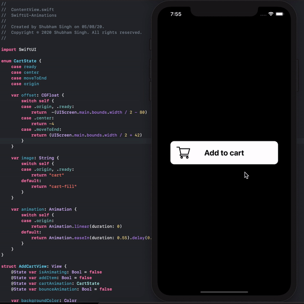

[View Code](SwiftUI-Animations/Code/Animations/Cart)

</td>
<td width="33%" align="center">

**Chat Bar**

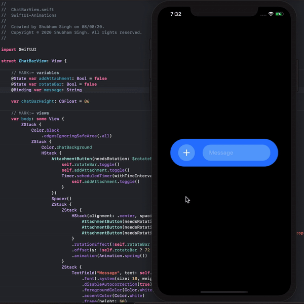

[View Code](SwiftUI-Animations/Code/Animations/ChatBar)

</td>
<td width="33%" align="center">

**Wi-Fi Signal**

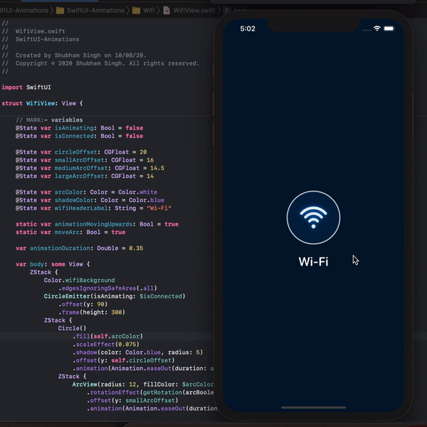

[View Code](SwiftUI-Animations/Code/Animations/Wifi)

</td>
</tr>
<tr>
<td align="center">

**Loader**

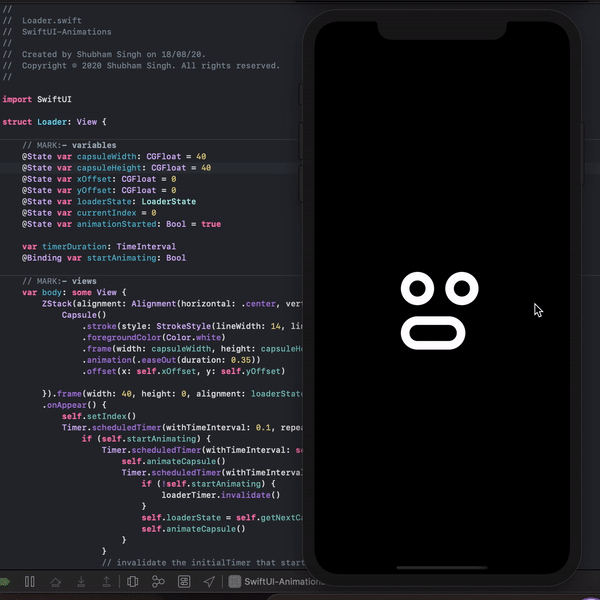

[View Code](SwiftUI-Animations/Code/Animations/Loader)

</td>
<td align="center">

**Add Item**

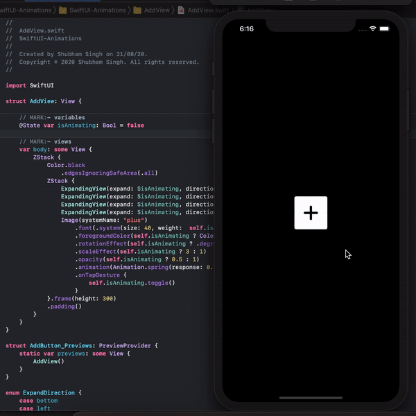

[View Code](SwiftUI-Animations/Code/Animations/AddView)

</td>
<td align="center">

**Circle Loader**

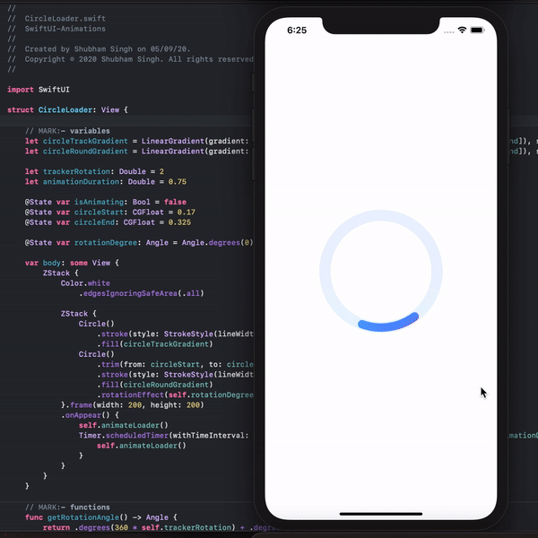

[View Code](SwiftUI-Animations/Code/Animations/CircleLoader)

</td>
</tr>
<tr>
<td align="center">

**Pill Loader**

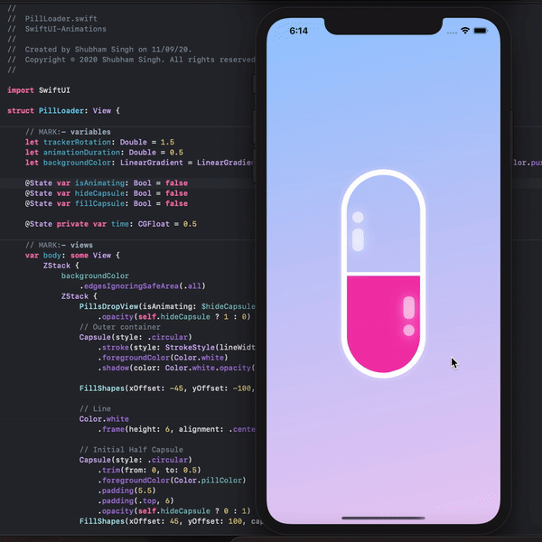

[View Code](SwiftUI-Animations/Code/Animations/PillLoader)

</td>
<td align="center">

**Like Button**

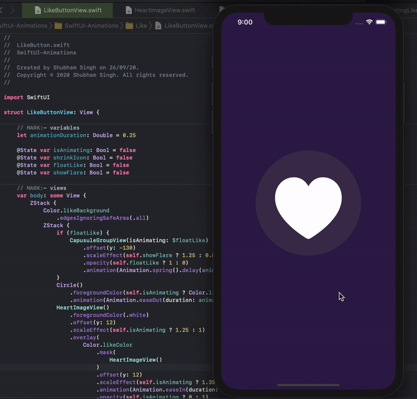

[View Code](SwiftUI-Animations/Code/Animations/Like)

</td>
<td align="center">

**Submit Button**

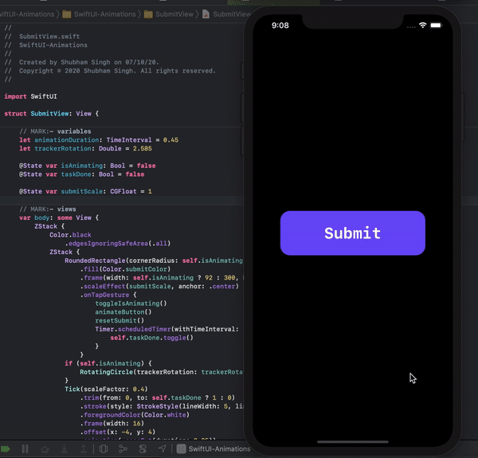

[View Code](SwiftUI-Animations/Code/Animations/SubmitView)

</td>
</tr>
<tr>
<td align="center">

**GitHub Octocat Loader**

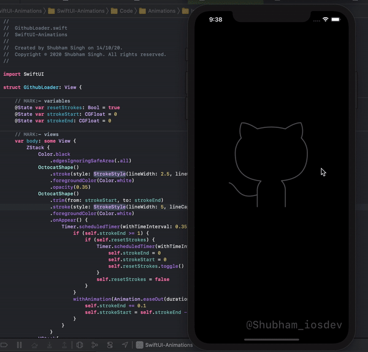

[View Code](SwiftUI-Animations/Code/Animations/GithubLoader)

</td>
<td align="center">

**3D Rotating Loader**

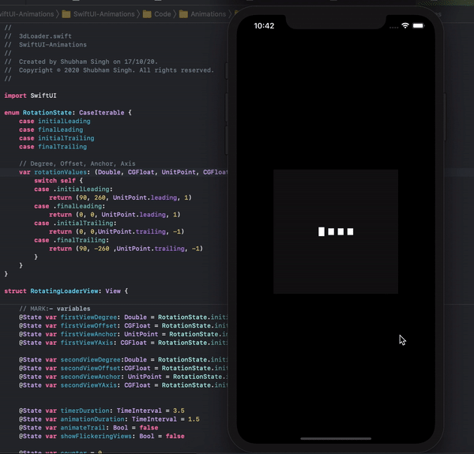

[View Code](SwiftUI-Animations/Code/Animations/3dLoader)

</td>
<td align="center">

**Animated Login**

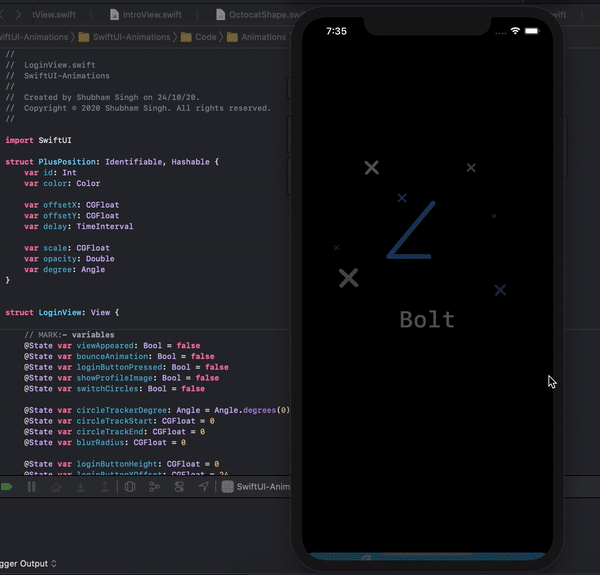

[View Code](SwiftUI-Animations/Code/Animations/LoginView)

</td>
</tr>
<tr>
<td align="center">

**Book Loader**

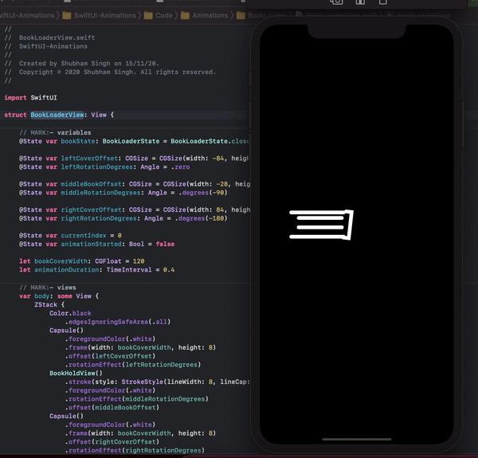

[View Code](SwiftUI-Animations/Code/Animations/BookLoader)

</td>
<td align="center">

**Card Viewer**

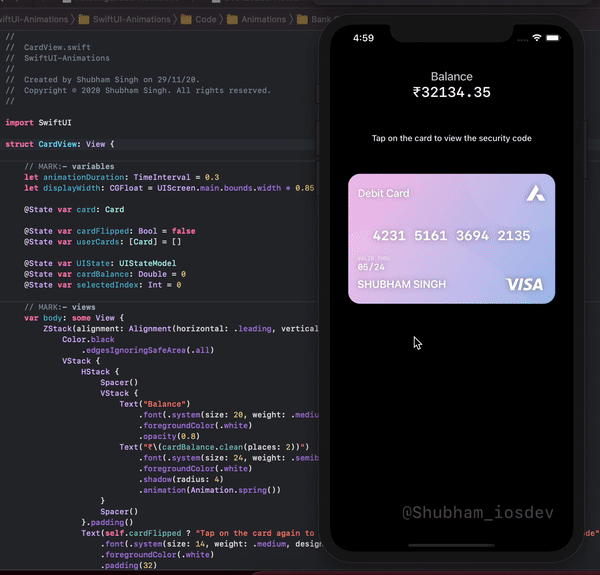

[View Code](SwiftUI-Animations/Code/Animations/Bank%20Card)

</td>
<td align="center">

**Infinity Loader**

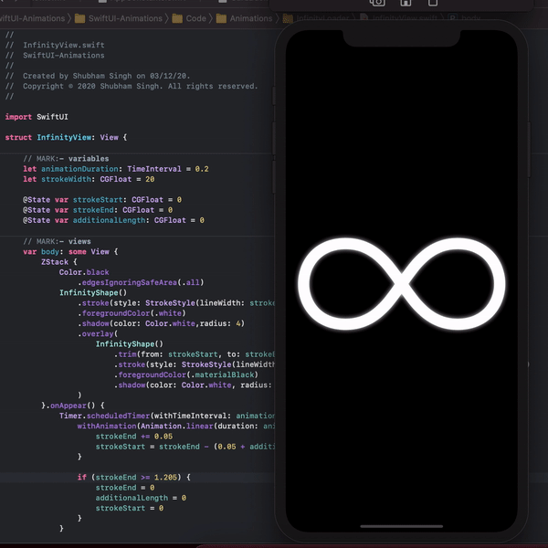

[View Code](SwiftUI-Animations/Code/Animations/InfinityLoader)

</td>
</tr>
<tr>
<td align="center">

**Light Switch**

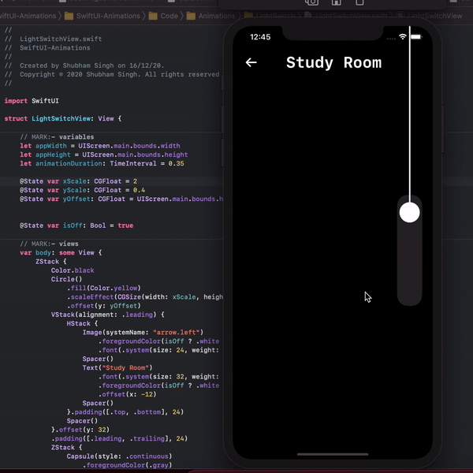

[View Code](SwiftUI-Animations/Code/Animations/LightSwitch)

</td>
<td align="center">

**Spinning Loader**

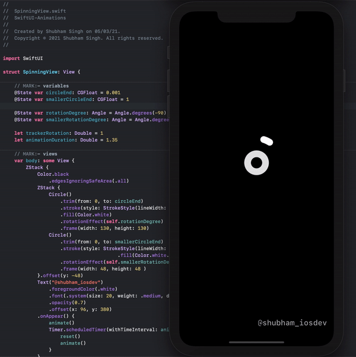

[View Code](SwiftUI-Animations/Code/Animations/SpinningLoader)

</td>
<td align="center">

**Download Button**

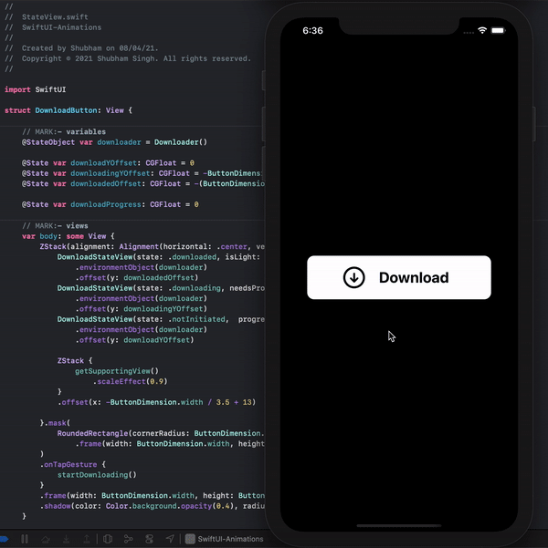

[View Code](SwiftUI-Animations/Code/Animations/DownloadButton)

</td>
</tr>
<tr>
<td align="center">

**Triangle Loader**

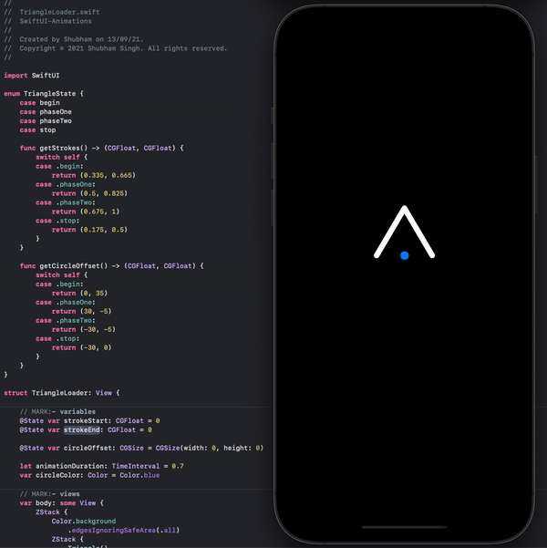

[View Code](SwiftUI-Animations/Code/Animations/TriangleLoader)

</td>
<td align="center">

**Octocat Wink**

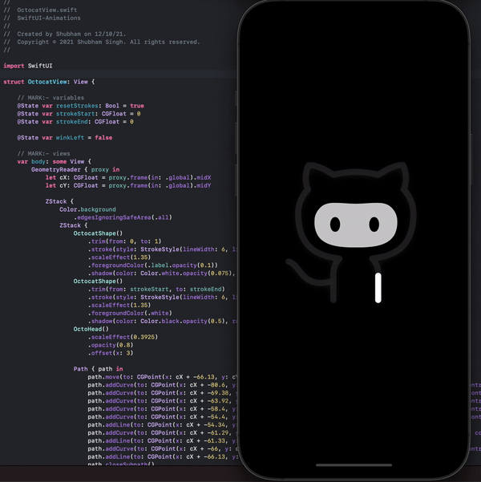

[View Code](SwiftUI-Animations/Code/Animations/Octocat-Wink)

</td>
<td align="center">

**Yin-Yang Toggle**

[View Code](SwiftUI-Animations/Code/Animations/YinYang-Toggle)

</td>
</tr>
</table>

## Project Structure

```
SwiftUI-Animations/
├── Code/
│   ├── Animations/          # Each animation in its own folder
│   │   ├── Cart/
│   │   ├── ChatBar/
│   │   ├── Wifi/
│   │   ├── ...              # 20+ animation folders
│   │   └── YinYang-Toggle/
│   ├── Modules/
│   │   └── Home/            # Home screen / navigation
│   ├── Services/            # Haptic feedback manager
│   └── Utils/               # Shared colors & helpers
├── GIFs/                    # Animation preview GIFs
└── SwiftUI-Animations.xcodeproj
```

## Contributing

Contributions are welcome! Whether it's a new animation, a bug fix, or an improvement to an existing one, feel free to open a pull request.

1. **Fork** the repository
2. **Create** a feature branch (`git checkout -b feature/amazing-animation`)
3. **Add** your animation inside `SwiftUI-Animations/Code/Animations/YourAnimation/`
4. **Commit** your changes (`git commit -m 'Add amazing animation'`)
5. **Push** to your branch (`git push origin feature/amazing-animation`)
6. **Open** a Pull Request

### Guidelines

- Keep each animation self-contained in its own folder
- Include any custom shapes in a `Support Shapes/` subfolder
- Use SwiftUI-native approaches — avoid UIKit bridges where possible
- Add a GIF preview to the `GIFs/` folder for your animation

## Author

**Shubham Kumar Singh**

[](https://www.instagram.com/shubham_iosdev/)
[](https://www.linkedin.com/in/shubham0812/)
[](https://github.com/Shubham0812)

## License

This project is licensed under the **Apache License 2.0** — see the [LICENSE](LICENSE.md) file for details.

---

<div align="center">

If you found this project helpful, please consider giving it a star!

**[Star this repo](https://github.com/Shubham0812/SwiftUI-Animations)**

</div>
